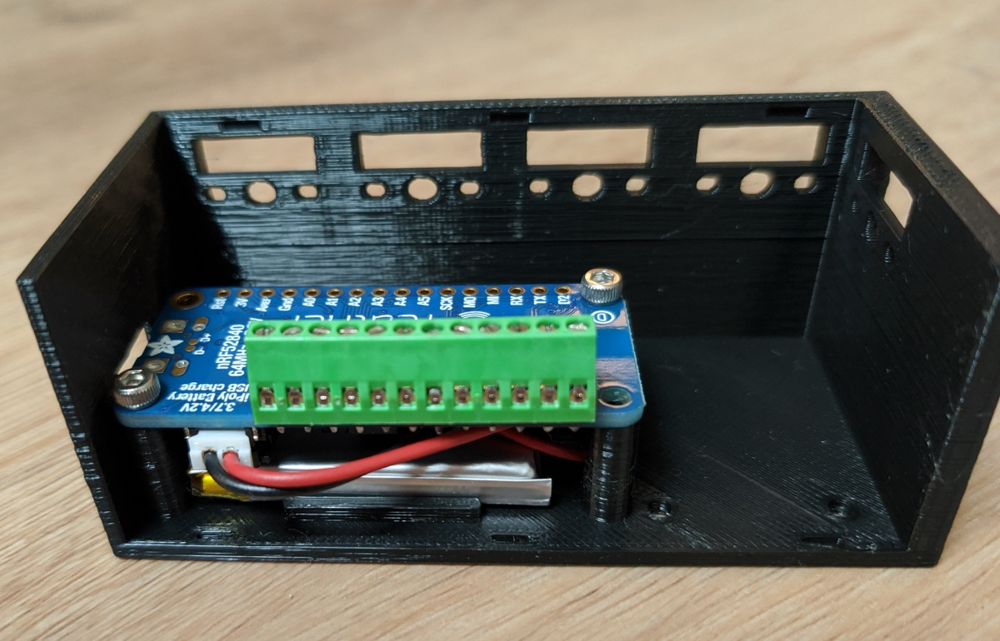

# Kinetikeys Chorder

Kinetikeys Chorder (aka Kinetikeys-Concept1) is a wearable, wireless, mechanical chording keyboard with one main goal in mind:

**Allow You To Type While Walking**

# Work-in-Progress!
I'll be updating the repo in the upcoming days with more detailed information. If you're reading this, it's quite likely that you're coming from the [Reddit thread](https://www.reddit.com/r/MechanicalKeyboards/comments/j3jyt3/type_while_walking_are_you_thinking_about_this_too/).

I uploaded the STL files for the left hand. You can already 3D print and use them as-is.

### Parts / Materials
* 3D Printer (or access to one)
* 2 x [Adafruit Feather nRF52840 Express](https://www.adafruit.com/product/4062) microcontrollers
* 2 x [LiPoly 3.7v 350mAh](https://www.adafruit.com/product/2750) batteries
* 10 x [Kailh Choc Low-Profile](https://novelkeys.xyz/collections/switches/products/kailh-low-profile-switches?variant=3747939680296) switches
* 16 x [M2.5 screws](https://www.amazon.com/HVAZI-Metric-Stainless-Socket-Assortment/dp/B07F14J7X8)
* [Thin wire](https://www.amazon.com/StrivedayTM-Flexible-Silicone-electronic-electrics/dp/B01KQ2JNLI) to connect the switches to the microcontroller
* [Grip adhesive tape](https://www.amazon.com/Meister-StickElite-Professional-Porous-Athletic/dp/B06W9M7J2P)
* Optional: [Terminal Block Kit](https://www.adafruit.com/product/3173) for Feather
* Optional: 5-wire block connector (for all ground wires)

### Build Guide
1. Print all the STL files using regular PLA

2. Solder the terminal block to the microcontroller. If you have a different preference on how to connect the wires to your microcontroller (e.g dupont connectors), go ahead and use that. Ideally don't solder the wires directly to the board. This would allow you to:
   * Reuse the board later on
   * solder the wires to the switches far enough from the PLA

3. Connect the battery to the microcontroller. Place it nicely under the controller and use screws to connect the microcontroller to the Main Body

4. Prepare all the 5 switches by attaching 2 wires to each one. In my example, the black wires go directly to the microcontroller pins, and the yellow wires all connect together to ground. I always start with wires a little longer than necessary and trim them before the final connection

5. Insert all the switches to their designated sockets in the Main Body

6. For each switch, attach the black wire to the microcontroller and the other one to the joint ground. You could also wire the ground by pasing a single wire from one switch to the other, and then attach the final one to the ground pin, but that would require you to solder very close to the PLA.
   * Solder all 5 ground wires together, or use a 5-wire block connector
   * Connect a single wire from all joined ground wires, to the GND pin on the microcontroller
   * I used pins A0-A4 for the left hand, and pins 9-13 for the right hand. For each hand respectively, these are the pins farther from the switches, giving more wiggle room with the wires

7. Attach the keycaps to the switches
8. Use two M2.5 screws to attach the Hand Rest to the Main Body

9. Put the Hand Strap in water of about 160 degrees F or 70 degrees C for a few seconds until it softens and quickly pull it out of the water and mold around you hand (just the 4 fingers in front of the thumb). It should be snuggly and comfotable, with a firm, yet not tight grip.
10. Attach the Hand Strap to the Hand Rest using 2 screws, washers and flush nuts

11. Attach the Cover (note: I need to redesign the way it connects to the main body. In the meanwhile, use some additional adhesive tape to secure it to place.
12. Wrap the hand-strap in adhesive tape so that it feels nicer and more secure on your hand
13. Flash the firmware (It's an Arduino-compatible [PlatformIO](https://platformio.org/) project. NOTE: I'm currently working on an updated firmware where one hand is master and the other is slave.

Alright! You're ready to go! Customize the keymap to your liking (right now it's just a dummy a-z mapping for testing). I'll add mine in the upcoming days.

# Previous Work
Check out my previous attempt at a wearable keyboard: [Kinetikeys-Concept0](https://github.com/liorgonnen/kinetikeys-concept0).
